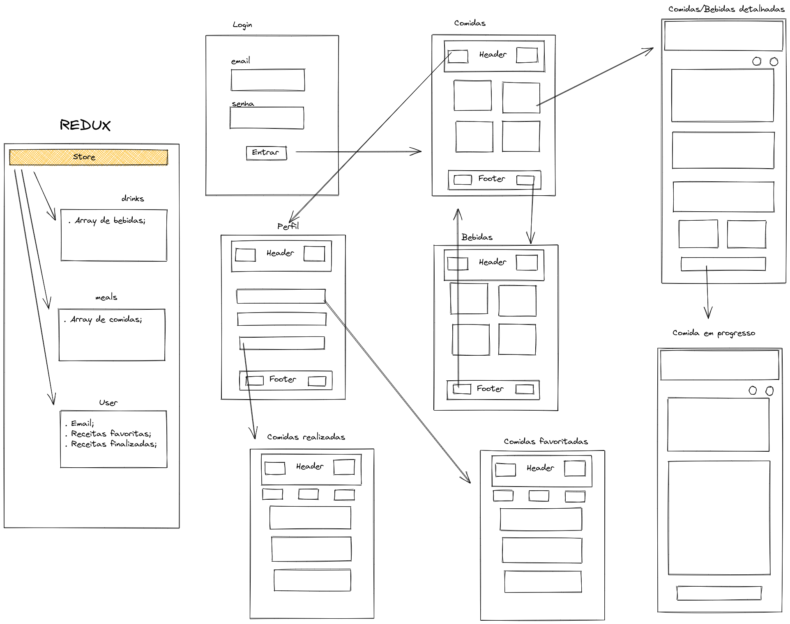

# Recipe App

---

## About the project

> The goal was to build from scratch a frontend application of cooking recipes, both beverage and food, using TDD. For that, first, we elaborated an outline of what the application would be, how many pages and components it would have, if we would use Context API or Redux, etc.
> 
> This trybe web development course project was done in conjunction with [walacenascimento](https://github.com/walacenascimento), [RoyMusthang](https://github.com/RoyMusthang), [rjanovicci](https://github.com/rjanovicci) and [pinhob](https://github.com/pinhob).

---

## About development

> After that, we separated in pairs, each pair taking a page to make, but always maintaining communication between everyone. One of us (me) was to help, for when a more complex problem or bug appeared. To work and communicate well, we use zoom and its breakouts rooms, as well as Trello and slack to communicate asynchronously.
> The rule was to always think about the problem to solve, how to solve it, do the tests and, finally, code (all of this, always keeping code clean). Using agile methodologies, we noticed that the beginning was a little slow, due to the time we took to organize ourselves, but then we saw that it was not wasted time.
> Although CSS is just getting started, we were able to complete this project with 97% coverage in just 7 days. The deadline was 10 days. That is, always use agile methodologies ;)

---

## Getting Started

- Clone this repository: `$git clone git@github.com:Murilo-Rainho/recipe-app.git`

- Enter the local directory that was just created: `$cd recipe-app`

- Install dependencies: `$npm i`

- run `$npm start` to start the app at port 3000.

---

> [This is my project rep.](https://github.com/tryber/sd-013-a-project-recipes-app)
Our branch: main-group-24-dev
